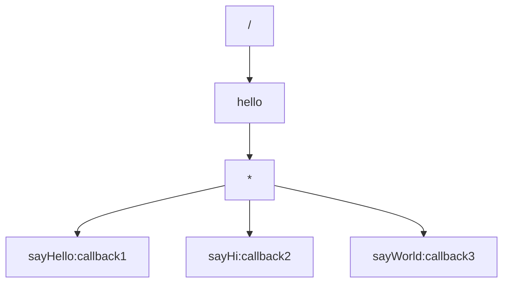

# mqtt-spring-boot-starter

> 快速配置mqtt; 省去mqttClient的代码编写成本; 通过共同接口定义使接收方和发送方之间达成协议一致性

## FEATURE

* 通过YML快速配置MQTT
* 通过注解实现MQTT主题订阅回调代码的编写
* 通过APT自动生成MQTT消息发送代理
* 通过响应总线机制实现MQTT消息请求响应
* 使用自定义Reply实现异步编程

# QuickStart

1. Define an interface for mqtt publish/subscribe service

```java

@MqttProxyGen
public interface MqttUserService {

    @Topic(topic = "/user/{userId}")
    MqttReply<Void> sendMsg(String userId, String msg);

}
```

2. publish mqtt msg example

```java

@SpringBootTest(classes = QuickStartApplication.class)
public class MqttUserServiceTest {

    @Autowired
    private MqttUserService mqttUserService;

    @Test
    @DisplayName("send hello world")
    public void sendHelloWorld() {
        //send mqtt msg to topic:/user/12 payload:hello world
        mqttUserService.sendMsg("12", "hello world")
                //receive mqtt reply
                .replyHandle(ar -> {
                    //if mqtt reply is success
                    if (ar.success()) {
                        System.out.println("send success");
                    } else {
                        System.out.println("send fail, errMsg:" + ar.errMsg());
                    }
                });
        LockSupport.park();
    }
}
```

3. subscribe mqtt msg example

```java

@MqttController(log = true)
public class MqttUserController implements MqttUserService {

    @Override
    //subscribe mqtt topic:/user/12
    @EmqSubscribe("userId=${user.id}")
    //when receive msg from topic:/user/12, this method will be invoked, and msg is payload
    public MqttReply<Void> sendMsg(String userId, String msg) {
        if (msg == null || msg.length() == 0) {
            return MqttReply.failReply("msg can not be null");
        } else {
            System.out.println("user[" + userId + "] receive msg: " + msg);
            return MqttReply.successReply();
        }
    }

}
```

## IMPORT

```xml

<dependencies>
    <dependency>
        <groupId>info.tianyuan</groupId>
        <artifactId>mqtt-spring-boot-starter-processor</artifactId>
        <version>1.0-SNAPSHOT</version>
        <scope>provided</scope>
    </dependency>
    <dependency>
        <groupId>info.tianyuan</groupId>
        <artifactId>mqtt-spring-boot-starter-annotation</artifactId>
        <version>1.0-SNAPSHOT</version>
        <scope>compile</scope>
    </dependency>
</dependencies>
```

## CONFIGURE

```yml
mqtt:
  host: 192.168.1.5            # mqtt代理服务器地址
  port: 1883                # mqtt端口
  client-id: hse.edge.dev    # mqtt客户端ID
  user-name: stub            # mqtt用户名
  password: stub            # mqtt密码
  clean-session: true        # 是否清理session
  sub-topics: # 初始化订阅主题
    - topic: /hse/down/gateway/10007/addCamera
      qos: 1
    - topic: /hse/v1/down/gateway/10007/getDoorGuards
      qos: 1
    - topic: /hse/v1/down/gateway/10007/addDoorGuard
      qos: 1
  will-topic: # 遗愿消息
    topic: test                # 遗愿消息主题
    qos: 2                    # 遗愿消息消息的qos
    will-msg: test            # 遗愿消息消息体
```

## USAGE

### 启动

```java
//services为定义的MqttService包的位置, 没有可以不加
@EnableMqttAutoConfiguration(services = "info.tianyuan.hse.camzkt.mqtt.service")
@SpringBootApplication
public class CamZKTCoreApplication {

    public static void main(String[] args) {
        SpringApplication.run(CamZKTCoreApplication.class, args);
    }

}
```

### 消费主题消息

配置文件：

```yml
mqtt:
  host: 192.168.1.5
  port: 1883
  client-id: hse.edge.dev
  user-name: stub
  password: stub
  clean-session: true
  sub-topics:
    - topic: /hello/+
      qos: 1
```

先定义好一个订阅处理Controller

```java

@MqttController(log = true)                //是否打开日志
public class SimpleMqttController {

    @Subscribe(topic = "/hello/{helloId}")        //订阅主题，其中helloId为通配符
    public void simpleSub(String helloId, String msgBody) {
        System.out.println(helloId);
        System.out.println(msgBody);
    }

}
```

这个时候发布一个MQTT消息

```java

@RunWith(SpringRunner.class)
@SpringBootTest(classes = CamZKTCoreApplication.class)
@Slf4j
public class SimpleControllerTest {

    @Autowired
    private MqttClient mqttClient;

    @Test
    public void testSendHello() throws MqttException {
        mqttClient.publish("/hello/hello", "world".getBytes(StandardCharsets.UTF_8), 1, false);
    }

}
```

那么这个时候就会打印出

```java
hello
        world
```

### 发布主题消息

首先定义一个接口

```java

@MqttProxyGen
public interface SendHelloService {

    @Subscribe(topic = "/hello/{helloId}", qos = 1, reply = false)
    void sendHello(String helloId, String msg);

}
```

然后就可以在Spring中使用了

```java

@RunWith(SpringRunner.class)
@SpringBootTest(classes = CamZKTCoreApplication.class)
@Slf4j
public class SimpleControllerTest {

    @Autowired
    private MqttClient mqttClient;

    @Autowired
    private SendHelloService sendHelloService;

    @Test
    public void testSendHello() throws MqttException {
        mqttClient.publish("/hello/hello", "world".getBytes(StandardCharsets.UTF_8), 1, false);
    }

    @Test
    public void testNewSendHello() {
        sendHelloService.sendHello("hello", "world");
    }

}
```

与此同时，订阅消息的Service也可以继承这个接口，来完成订阅消息的处理

```java

@MqttController(log = true)
public class NewSimpleMqttController implements SendHelloService {

    @Override
    public void sendHello(String helloId, String msg) {
        System.out.println(helloId);
        System.out.println(msg);
    }

}
```

### MQTT实现请求响应

首先定义一个接口

```java

@MqttProxyGen
public interface GetNameService {

    @Subscribe(topic = "/people/{peopleId}", qos = 1, reply = false)
    Future<String> getName(String peopleId, Void v);

}
```

然后发送一个消息等待响应，注意，这个过程实际上是一个异步回调的过程

```java

@RunWith(SpringRunner.class)
@SpringBootTest(classes = CamZKTCoreApplication.class)
@Slf4j
public class GetNameServiceTest {

    @Autowired
    private GetNameService getNameService;

    @Test
    public void getNameTest() {
        getNameService.getName("123", null)
                .completeHandle(ar -> {
                    if (ar.isSuccess()) {
                        System.out.println(ar.result());
                    } else {
                        System.out.println(ar.errMsg());
                    }
                });
    }

}
```

mqtt处理消息

```java

@MqttController(log = true)
public class GetNameMqttController implements GetNameService {

    @Override
    public Future<String> getName(String peopleId, Void v) {
        if ("123".equals(peopleId)) {
            return Future.successFuture("bob");
        } else {
            return Future.failFuture("people not exits");
        }
    }
}
```

### SpringMVC实现HTTP异步请求响应

```java

@RestController
@RequestMapping("/mqtt")
public class TestController {

    @Autowired
    private GetNameService getNameService;


    @RequestMapping(value = "getPeopleName", method = RequestMethod.POST)
    public DeferredResult<String> getName(String peopleId) {
        DeferredResult<String> result = new DeferredResult<>();
        getNameService.getName(peopleId, null)
                .completeHandle(ar -> {
                    if (ar.isSuccess()) {
                        result.setResult(ar.result());
                    } else {
                        result.setErrorResult(ar.errMsg());
                    }
                });
        return result;
    }

}
```

## HOW IT WORKS

### 主题订阅树: 主题匹配和消息回调

> info/tianyuan/spring/starter/mqtt/config/MqttControllerBeanProxyHandler.java

```java

@Component
public class MqttControllerBeanProxyHandler implements ApplicationContextAware {

    @Autowired
    private MqttClient mqttClient;
    private final MqttCallBackManager<MqttMsg> mqttCallBackManager = new MqttCallBackManager<>();


    @SuppressWarnings("rawtypes")
    @Override
    public void setApplicationContext(ApplicationContext applicationContext) throws BeansException {
        mqttClient.setCallback(new MqttCallback() {
            @Override
            public void messageArrived(String topic, MqttMessage message) {
                mqttCallBackManager.pushNewMsg(topic, new MqttMsg(topic, message));
            }
        });
        //获取所有的包含mqtt Controller的bean
        Map<String, Object> beansWithAnnotation = applicationContext.getBeansWithAnnotation(MqttController.class);
        //....
        //开始遍历父接口和本类的method
        for (Object mqttController : beansWithAnnotation.values()) {

            for (Method method : subscribeHandleMethodList) {
                Subscribe topicAnnotation = method.getAnnotation(Subscribe.class);

                //处理Subscribe注解
                mqttCallBackManager.addSubsCallBack(topicAnnotation.topic(), (topicMatchArray, msg) -> {
                    //找到topic的元素，同时填入方法里面
                    MqttMessage mqttMsg = msg.getMqttMessage();

                    try {
                        //...
                        //匹配主题参数还有转换mqtt消息体后调用这个方法
                        Object result = MethodInvokeUtil.invoke(method, mqttController, params);
                        // 看是否需要进行返回, 如果需要的话
                        if (mqttRespMsg != null) {
                            MqttRespMsg finalMqttRespMsg = mqttRespMsg;
                            ((Future<?>) result).completeHandle(ar -> {
                                mqttClient.publish(MqttXUtil.genRespBusTopic(finalMqttRespMsg.getClientId()), respPayload, 1, false);
                            });
                        }

                    } catch (MqttServiceException e) {
                        // 如果发生错误了, 那就把错误信息发到回复消息总线里面
                    } catch (Throwable e) {
                        log.error("invoked method {}.{} error", mqttController.getClass().getSimpleName(), method.getName(), e);
                    }
                });
            }
        }
```

这里重要的对象是这个对象`mqttCallBackManager`，最主要的两个方法是以下两个:

发布消息：

```java
mqttCallBackManager.pushNewMsg(topic,new MqttMsg(topic,message));
```

订阅消息：

```java
mqttCallBackManager.addSubsCallBack(topicAnnotation.topic(),(topicMatchArray,msg)->{})
```

当在订阅消息的时候，会生成一个主题订阅树，目的是快速匹配消息，比如分别订阅了以下主题

`/hello/{helloId}/sayHello`

`/hello/{helloId}/sayWorld`

`/hello/{helloId}/sayHi`



### APT: 动态生成消息发布代理

```java

@MqttProxyGen
public interface SendHelloService {

    @Subscribe(topic = "/hello/{helloId}", qos = 1, reply = false)
    void sendHello(String helloId, String msg);

}
```

这个接口是怎么完成这么神奇的事情的

```java

@Target(ElementType.TYPE)
@Retention(RetentionPolicy.CLASS)
public @interface MqttProxyGen {
}
```

可以看到这个注解保留在Class阶段，其实使用的技术是APT技术，生成的代码长这个样子

```java

@Service
public class SendHelloServiceProxy implements SendHelloService {
    @Autowired
    private MqttClient mqttClient;

    @Autowired
    private MqttRespService mqttRespService;

    public void sendHello(String helloId, String msg) {
        try {
            byte[] payload = msg.toString().getBytes();
            mqttClient.publish("/hello/" + helloId + "", payload, 1, false);
        } catch (Exception e) {
        }
    }
}
```

具体怎么生成的代码可以看这个类`mqtt-spring-boot-starter-processor` `info/tianyuan/spring/starter/mqtt/processor/MqttServiceGenProcessor.java`

最主要用到的两个包是

```xml

<dependency>
    <groupId>com.squareup</groupId>
    <artifactId>javapoet</artifactId>
    <version>${javapoet.version}</version>
</dependency>

<dependency>
<groupId>com.google.auto.service</groupId>
<artifactId>auto-service</artifactId>
<version>1.0-rc6</version>
<optional>true</optional>
</dependency>
```

### 响应总线: 实现mqtt消息的请求响应

### 自定义Future: 实现异步返回

## TODO📜

- [ ] 使用ProtoBuf编码对象, 压缩体积
- [ ] 对方法参数进行校验
- [ ] 使用更通用的Future
- [ ] 实现不同MQTT客户端
- [ ] 加入Spring-starter的META-INF
- [x] 对异常机制更好的处理
- [ ] 对POJO进行校验
- [ ] 加入普通消息去重和超时检验特性
- [ ] 参数加入list和map的支持
- [ ] 整合web-controller
- [ ] 生成markdown协议文档
- [ ] 更好的处理初始化主题

